### БАГ1 [Chrome 139.0.7258.127 (Official Build) (64-bit)] На странице "Мероприятия" в поле ввода "Выбрать пользователя" не пропадает выпадающий список при очищении поля.

#### Шаги:
- Открыть страницу "Мероприятия".
- Ввести в поле ввода "Выбрать пользователя" любое значения, которое вызовет появление выпадающего списка, например, "а".
- Очистить поле ввода при помощи клавиши "Backspace".

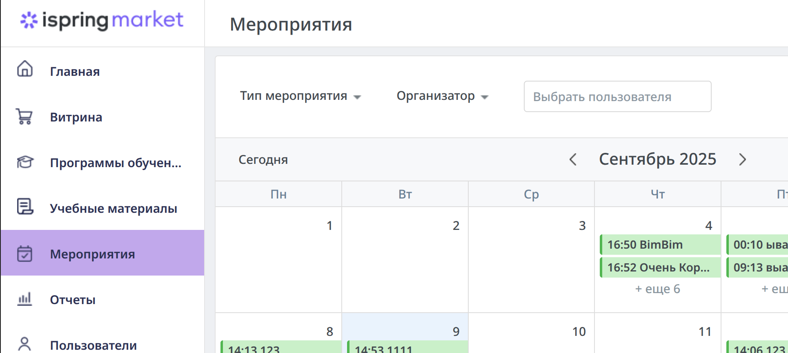
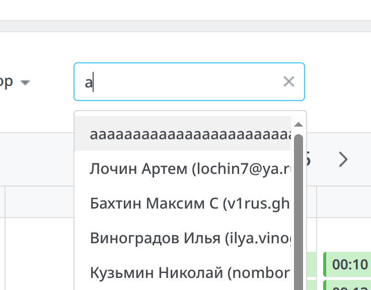

#### ФР: Выпадающий список не пропадает несмотря на то, что поле ввода пустое.

#### ОР: Выпадающий список пропадает, если поле ввода пустое.

### БАГ2 [Chrome 139.0.7258.127 (Official Build) (64-bit)] На странице "Мероприятия" при выборе пользователей в фильтре "Организатор" отсутствует тултип для отображения текста, который не влез в блок. 

#### Шаги:
- Открыть страницу "Мероприятия".
- В фильтре "Организатор" выбрать конкретного пользователя с длинным именем или нескольких пользователей.
- Применить фильтр при помощи кнопки "Применить" внизу выпадающего списка.
- Текст кнопки фильтра поменялся. Навести курсор мыши на этот текст.

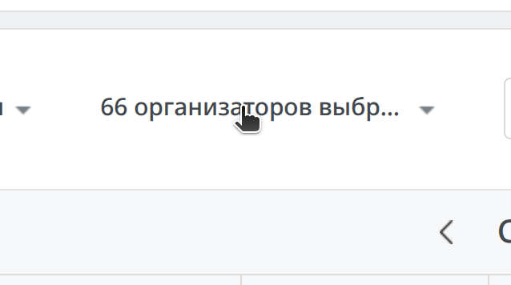

#### ФР: Отсутствует тултип с полным текстом: именем пользователя или количеством выбранных пользователей.

#### ОР: При наведении мыши на текст, который не влез в блок и сокращён при помощи "..." должен появляться тултип с полным текстом: именем пользователя или количеством выбранных пользователей.

### БАГ3 [Chrome 139.0.7258.127 (Official Build) (64-bit)] На странице "Мероприятия" поповер мероприятия при прокрутке страницы вниз накладывается поверх хэдера страницы.

#### Шаги:
- Открыть страницу "Мероприятия".
- Создать мероприятие, чтобы оно отображалось в календаре.
- Нажать на мероприятие в календаре. Откроется поповер с информацией о мероприятии.
- Прокрутить страницу максимально вниз.

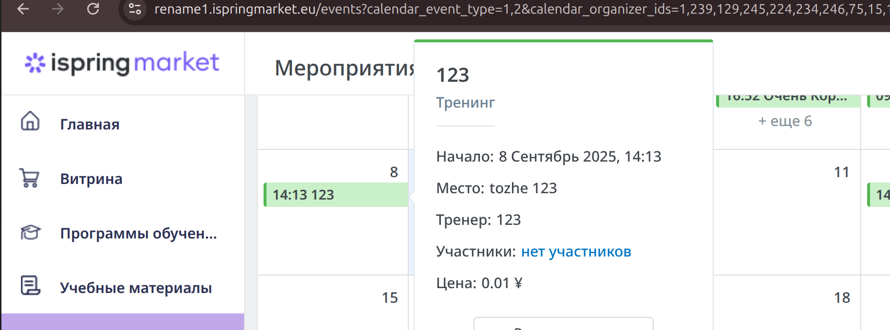

#### ФР: Поповер мероприятия накладывается поверх хэдера страницы.

#### ОР: Поповер должен находиться под хэдером, если их позиции на странице совпадают.

### БАГ4 [Chrome 139.0.7258.127 (Official Build) (64-bit)] На странице "Мероприятия" на поповере мероприятия длинное название обрезается.

#### Шаги:
- Открыть страницу "Мероприятия".
- Создать мероприятие с названием в 255 символов, чтобы оно отображалось в календаре.
- Нажать на мероприятие в календаре. Откроется поповер с информацией о мероприятии.

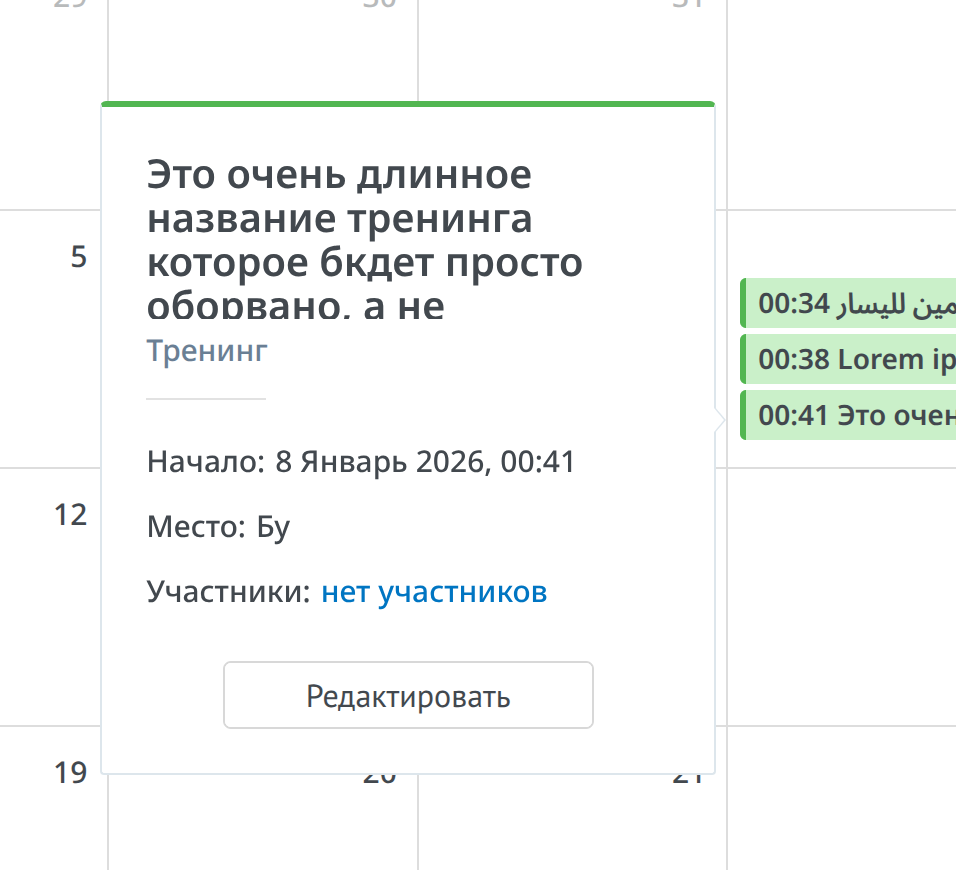

#### ФР: Название мероприятия не сокращается при помощи "...", а просто обрезается блоком названия, который имеет максимальную высоту.

#### ОР: Если текст названия слишком длинный, то он должен сокращаться при помощи "...".

### БАГ5 [Chrome 139.0.7258.127 (Official Build) (64-bit)] На странице "Создание нового мероприятия" в плейсхолдере поля ввода "Название мероприятия" написан неверный глагол.

#### Шаги:
- Открыть страницу "Мероприятия".
- Нажать синюю кнопку "Добавить" на верхней панели. 
- Выбрать пункт "Тренинг".

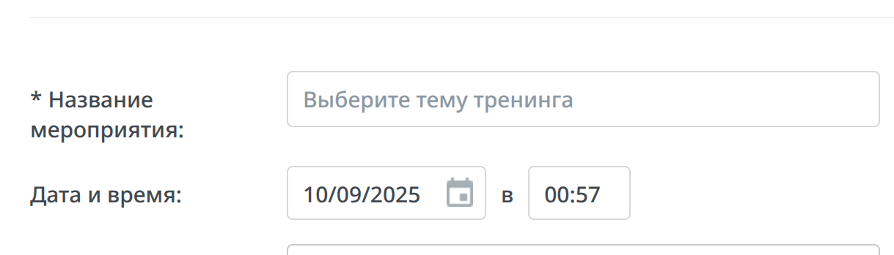

#### ФР: В плейсхолдере поля ввода "Название мероприятия" написан глагол "Выберите".

#### ОР: В плейсхолдере поля ввода "Название мероприятия" должен быть написан глагол "Введите", так как это обычное текстовое поле ввода, в котором нельзя ничего "Выбрать".

### БАГ6 [Chrome 139.0.7258.127 (Official Build) (64-bit)] На странице "Создание нового мероприятия" возможно указать невалидное значение времени мероприятия.

#### Шаги:
- Открыть страницу "Мероприятия".
- Нажать синюю кнопку "Добавить" на верхней панели.
- Выбрать пункт "Тренинг".
- Заполнить обязательные поля любыми значениями.
- В "Дата и время" указать время "00:09".
- Переставить каретку на "0" перед "9" — "00:**0**9".
- Нажать "Delete".
- Нажать кнопку "Сохранить".

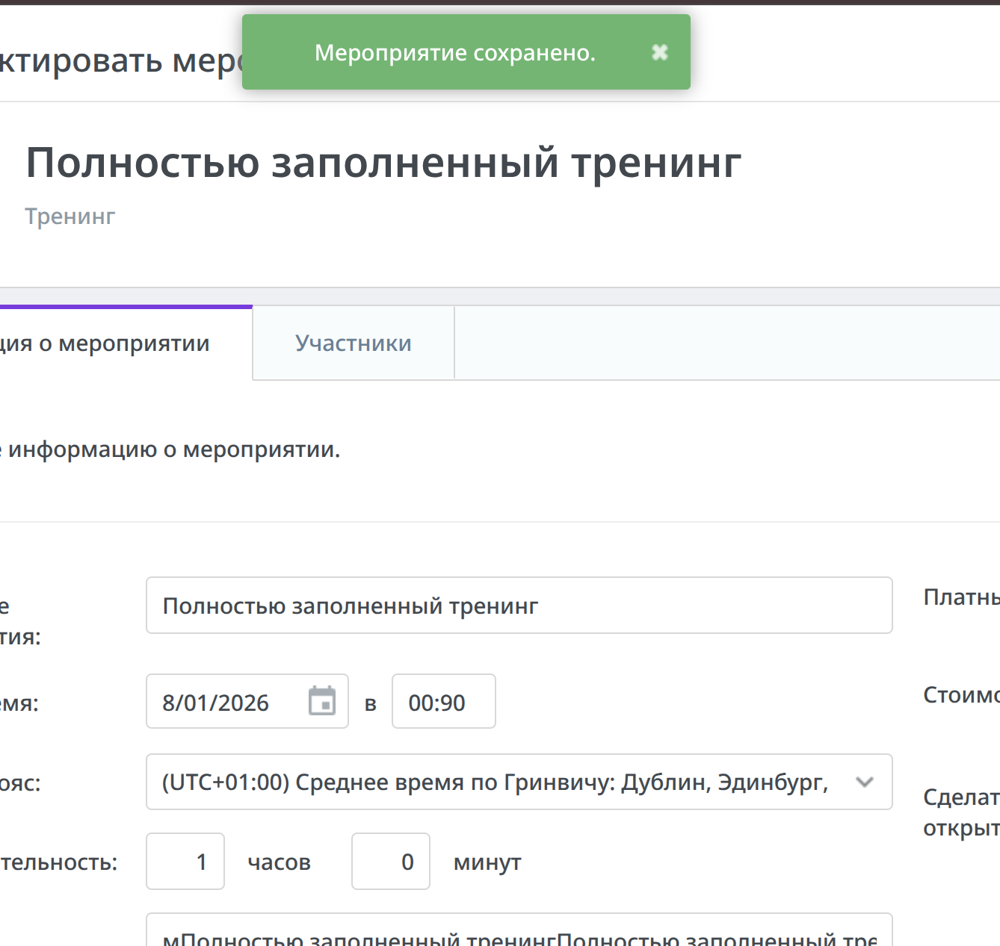

#### ФР: Мероприятие сохранилось с временем проведения "00:90", что является невалидным временем.

#### ОР: Пользователь не должен иметь возможности ввести невалидное время проведения мероприятие. Часы должны быть ограничены значениями от 00 до 23, а минуты значениями от 00 до 59. 

### БАГ7 [Chrome 139.0.7258.127 (Official Build) (64-bit)] На странице "Редактировать мероприятие" при отмене мероприятия нет предупреждения о необратимости удаления мероприятия.

#### Шаги:
- Открыть страницу "Мероприятия".
- Создать мероприятие, чтобы оно отображалось в календаре.
- Нажать на мероприятие в календаре, чтобы открылся поповер с информацией о мероприятии.
- Нажать на кнопку "Редактировать" внизу поповера.
- На странице "Редактировать мероприятие" нажать на кнопку "Отменить мероприятие".

#### ФР: Мероприятие удаляется без предупреждения.

#### ОР: При выполнении необратимых действий, которые влекут за собой безвозвратную потерю данных, необходимо показывать пользователю предупреждение о необратимости действия и дать пользователю возможность отменить его.

### БАГ8 [Chrome 139.0.7258.127 (Official Build) (64-bit)] На странице "Мероприятия" пропадает отображение прошедших мероприятий.

#### Шаги:
- Открыть страницу "Мероприятия".
- Нужно иметь в календаре прошедшие мероприятия. Так как нельзя создать мероприятие на прошедшую дату, то нужно создать на будущую и дождаться, когда оно пройдёт в реальном времени.
- Находясь в календаре, нажать кнопку "Список" в верхней панели календаря
- Нажать на любое мероприятие. Вы будете перенаправлены на страницу редактирования выбранного мероприятия.
- Выйти из редактирования мероприятия, нажав на "стрелочку" на верхней панели страницы, рядом с надписью "Редактировать мероприятие".
- Нажать на кнопку "Месяц", чтобы перейти к календарю.

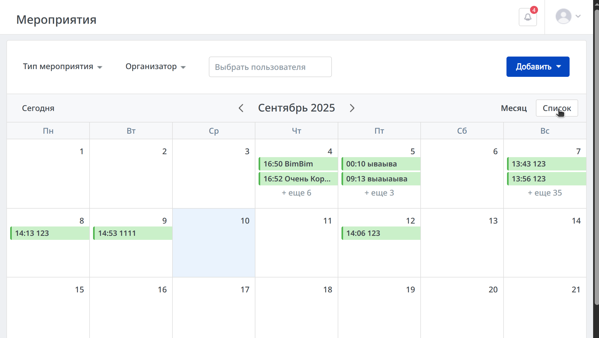
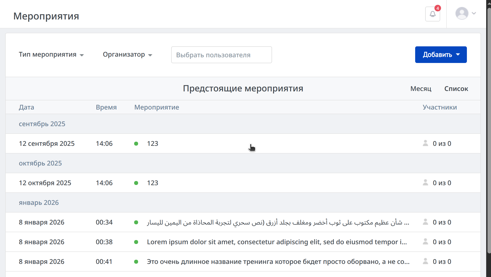
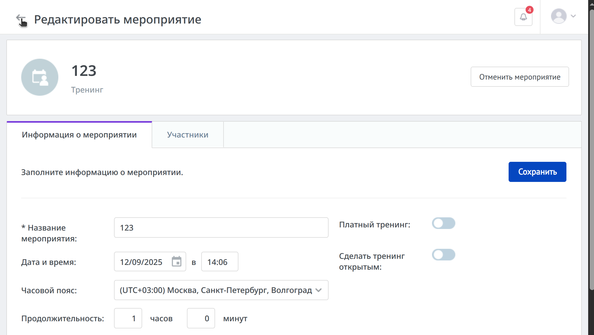

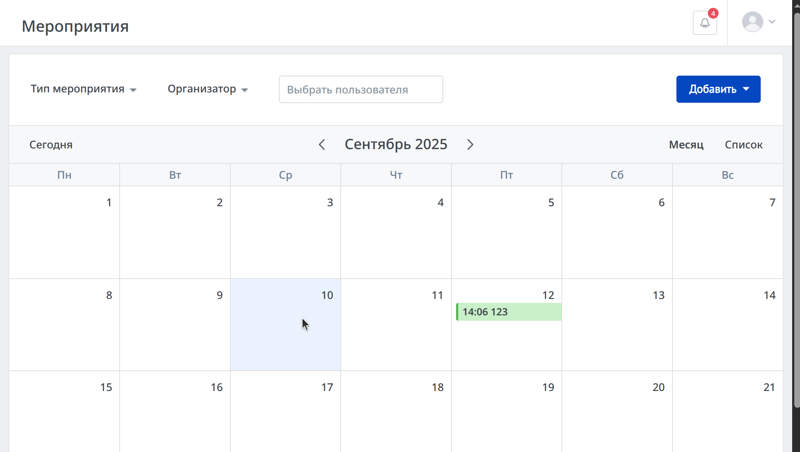

#### ФР: Пропало отображение прошедших мероприятий. Вернуть отображение можно, переключившись между месяцами.

#### ОР: Все мероприятия должны отображаться вне зависимости от того, прошли они или нет.

### БАГ9 [Chrome 139.0.7258.127 (Official Build) (64-bit)] На странице "Мероприятия" поповер всех мероприятий на день выходит за пределы экрана.

#### Шаги:
- Открыть страницу "Мероприятия".
- Создать на любой понедельник столько мероприятий (примерно 3), чтобы они начали скрываться и отображаться только при нажатии кнопки "ещё".
- Уменьшить ширину окна браузера до 900 пикселей, чтобы скрылась боковая левая панель.
- Нажать на кнопку "ещё", чтобы открыть поповер всех мероприятий на день, на который мы создали несколько мероприятий.

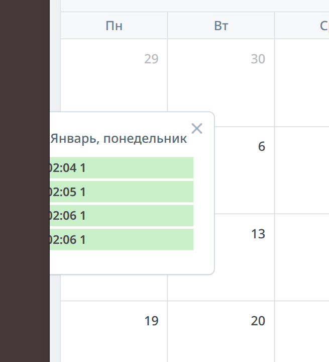

#### ФР: Поповер вышел за пределы окна браузера.

#### ОР: Поповер должен был сдвинуться вправо, чтобы не выходить за пределы экрана.

### БАГ10 [Chrome 139.0.7258.127 (Official Build) (64-bit)]

#### Шаги:
-

#### ФР:

#### ОР:

Идеи:
- ограничить количество вводимых символов в полях ввода, чтобы не отображать предупреждение
- если оставить поле названия пустым, то текст плейсхолдера и предупреждения не соотносятся
- точки в текстах, нужны ли они?
- тренинг и мероприятие, какое слово в итоге лучше использовать?
- "Выбрать пользователя" — ищет участников или организаторов или всё сразу? непонятно для пользователя
- дни недели с большой буквы в поповере списка мероприятий