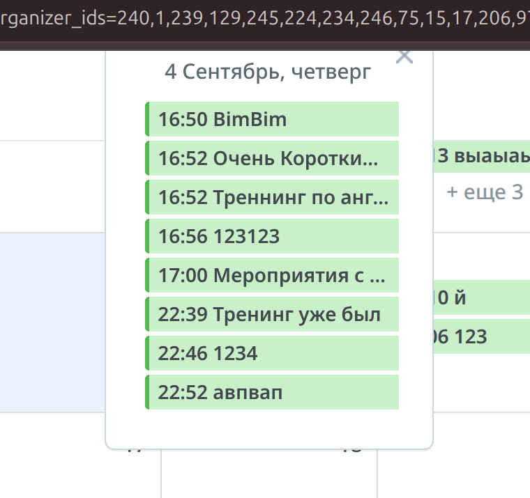
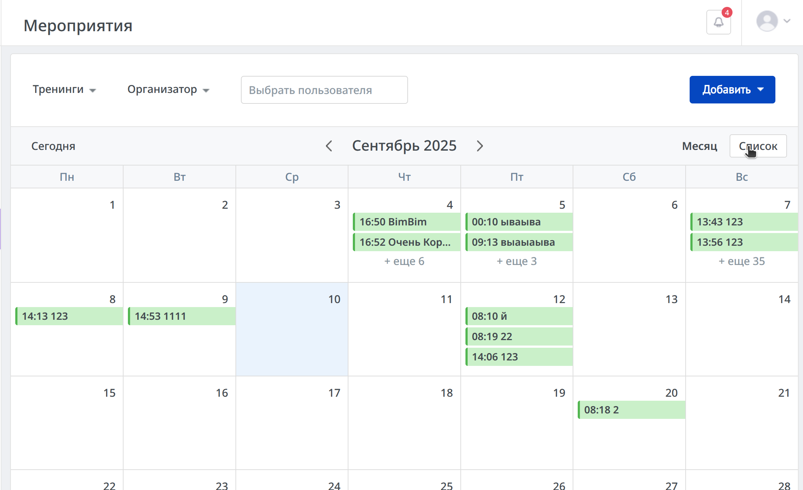
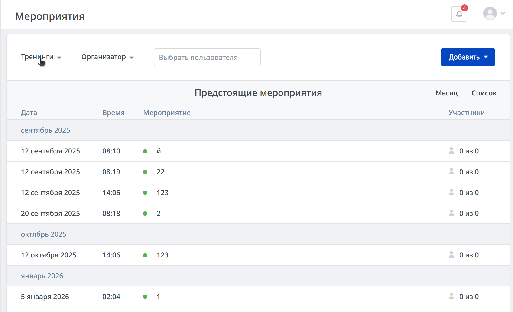
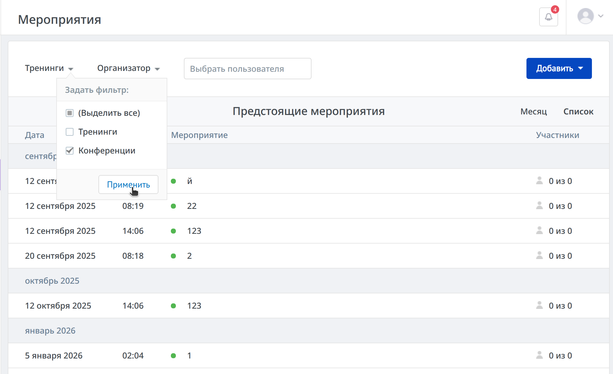
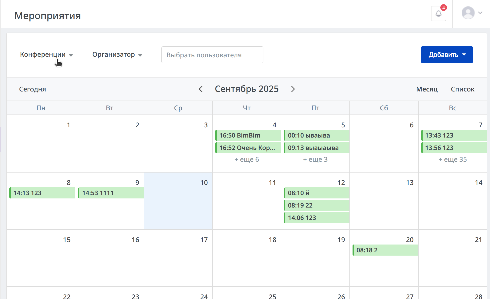
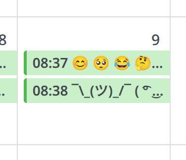
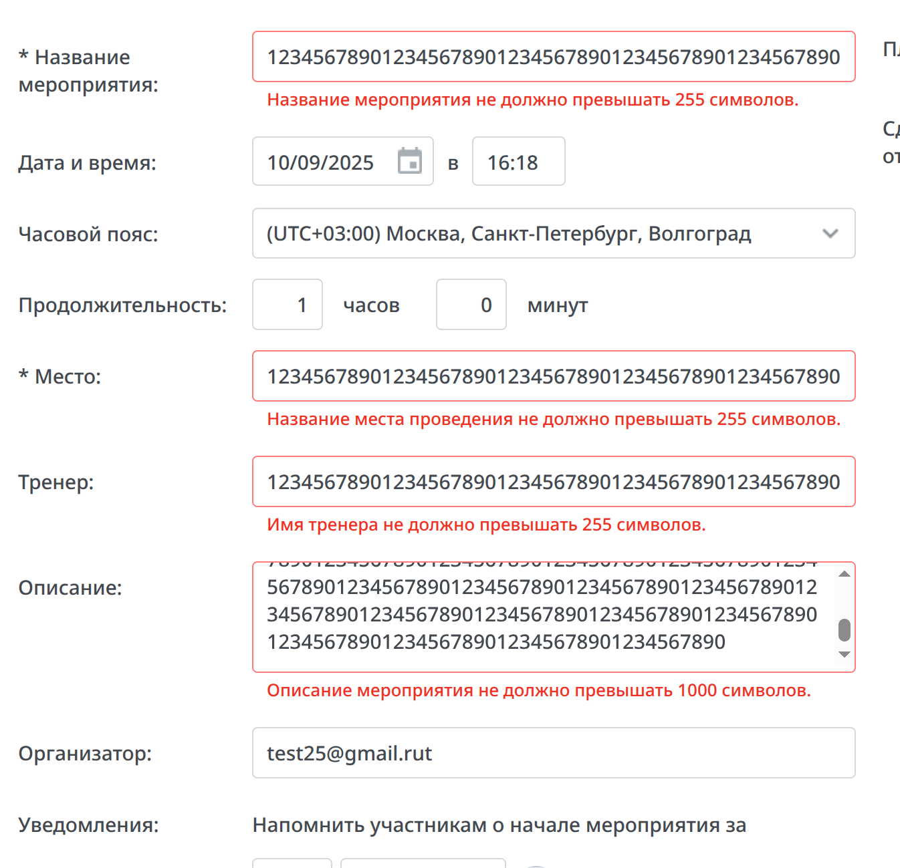

### БАГ1 [Chrome 139.0.7258.127 (Official Build) (64-bit)] На странице "Мероприятия" в поле ввода "Выбрать пользователя" не пропадает выпадающий список при очищении поля.

#### Шаги:
- Открыть страницу "Мероприятия".
- Ввести в поле ввода "Выбрать пользователя" любое значение, которое вызовет появление выпадающего списка, например, "а".
- Очистить поле ввода при помощи клавиши "Backspace" или "Delete" (не при помощи крестика).

#### ФР: Выпадающий список не пропадает несмотря на то, что поле ввода пустое.

#### ОР: Выпадающий список пропадает, если поле ввода пустое.

---

### БАГ2 [Chrome 139.0.7258.127 (Official Build) (64-bit)] На странице "Мероприятия" при выборе пользователей в фильтре "Организатор" не отображается тултип для сокращённого текста. 

#### Шаги:
- Открыть страницу "Мероприятия".
- В фильтре "Организатор" выбрать конкретного пользователя с именем длиной более 23 символов или нескольких пользователей - от пяти.
- Применить фильтр при помощи кнопки "Применить" внизу выпадающего списка.
- Навести курсор мыши на текст, который появился в поле фильтра.

#### ФР: Отсутствует тултип с полным текстом (именем пользователя или количеством выбранных пользователей).

#### ОР: При наведении курсора на сокращённый текст (с многоточием) должен появляться тултип с полным текстом (именем пользователя или количеством выбранных пользователей).

---

### БАГ3 [Chrome 139.0.7258.127 (Official Build) (64-bit)] На странице "Мероприятия" поповер мероприятия при прокрутке страницы вниз накладывается поверх хэдера страницы.

#### Шаги:
- Открыть страницу "Мероприятия".
- Создать мероприятие, чтобы оно отображалось в календаре.
- Нажать на мероприятие в календаре. Откроется поповер с информацией о мероприятии.
- Прокрутить страницу максимально вниз.

#### ФР: Поповер мероприятия накладывается поверх хэдера страницы.

#### ОР: Поповер должен находиться под хэдером, если их позиции на странице совпадают.

---

### БАГ4 [Chrome 139.0.7258.127 (Official Build) (64-bit)] На странице "Мероприятия" на поповере мероприятия длинное название обрезается.

#### Шаги:
- Открыть страницу "Мероприятия".
- Создать мероприятие с названием в 255 символов, чтобы оно отображалось в календаре.
- Нажать на мероприятие в календаре. Откроется поповер с информацией о мероприятии.

#### ФР: Название мероприятия обрезается блоком.

#### ОР: Если текст названия слишком длинный, он должен сокращаться с помощью многоточия.

---

### БАГ5 [Chrome 139.0.7258.127 (Official Build) (64-bit)] На странице "Создание нового мероприятия" в плейсхолдере поля ввода "Название мероприятия" написан неверный глагол.

#### Шаги:
- Открыть страницу "Мероприятия".
- Нажать синюю кнопку "Добавить" на верхней панели. 
- Выбрать пункт "Тренинг".

#### ФР: В плейсхолдере поля "Название мероприятия" написано "Выберите".

#### ОР: В плейсхолдере поля "Название мероприятия" должен быть написан глагол "Введите", так как это текстовое поле, в котором ничего нельзя "Выбрать".

---

### БАГ6 [Chrome 139.0.7258.127 (Official Build) (64-bit)] На странице "Создание нового мероприятия" возможно ввести невалидное значение времени мероприятия при редактировании поля.

#### Шаги:
- Открыть страницу "Мероприятия".
- Нажать синюю кнопку "Добавить" на верхней панели.
- Выбрать пункт "Тренинг".
- Заполнить обязательные поля любыми значениями.
- В "Дата и время" указать время "00:09".
- Переставить каретку на "0" перед "9" — "00:**0**9".
- Нажать "Delete".
- Нажать кнопку "Сохранить".

#### ФР: Мероприятие сохраняется с невалидным временем "00:90".

#### ОР: Пользователь не должен иметь возможности ввести невалидное время. Часы должны быть ограничены от 00 до 23, а минуты — от 00 до 59.

---

### БАГ7 [Chrome 139.0.7258.127 (Official Build) (64-bit)] На странице "Редактировать мероприятие" отсутствует предупреждение о необратимости удаления мероприятия.

#### Шаги:
- Открыть страницу "Мероприятия".
- Создать мероприятие, чтобы оно отображалось в календаре.
- Нажать на мероприятие в календаре, чтобы открылся поповер с информацией о мероприятии.
- Нажать на кнопку "Редактировать" внизу поповера.
- На странице "Редактировать мероприятие" нажать на кнопку "Отменить мероприятие".

#### ФР: Мероприятие удаляется сразу, без запроса на подтверждение.

#### ОР: При выполнении необратимых действий (таких, как удаление) должно появляться предупреждение о потере данных, дающее пользователю возможность отменить действие.

---

### БАГ8 [Chrome 139.0.7258.127 (Official Build) (64-bit)] На странице "Мероприятия" пропадает отображение прошедших мероприятий.

#### Шаги:
- Открыть страницу "Мероприятия".
- Нужно иметь в календаре прошедшие мероприятия. Так как нельзя создать мероприятие на прошедшую дату, то нужно создать на будущую и дождаться, когда оно пройдёт в реальном времени.
- Находясь в календаре, нажать кнопку "Список" в верхней панели календаря.
- Нажать на любое мероприятие. Вы будете перенаправлены на страницу редактирования выбранного мероприятия.
- Вернуться на предыдущую страницу, нажав на "стрелочку" на верхней панели страницы, рядом с надписью "Редактировать мероприятие".
- Нажать на кнопку "Месяц", чтобы перейти к календарю.

#### ФР: Пропало отображение прошедших мероприятий. Вернуть отображение можно, переключившись между месяцами.

#### ОР: Все мероприятия должны отображаться в календаре независимо от их даты.

---

### БАГ9 [Chrome 139.0.7258.127 (Official Build) (64-bit)] На странице "Мероприятия" поповер всех мероприятий на день выходит за пределы экрана.

#### Шаги:
- Открыть страницу "Мероприятия".
- Создать на любой понедельник столько мероприятий, чтобы они начали скрываться и отображались только при нажатии кнопки "ещё".
- Уменьшить ширину окна браузера до 900 пикселей, чтобы скрылась боковая левая панель.
- Нажать на кнопку "ещё", чтобы открыть поповер всех мероприятий на день, на который мы создали несколько мероприятий.

#### ФР: Поповер вышел за пределы окна браузера.

#### ОР: Поповер должен был сдвинуться вправо, чтобы не выходить за пределы экрана.

---

### БАГ10 [Chrome 139.0.7258.127 (Official Build) (64-bit)] На странице "Мероприятия" поповер списка мероприятий при прокрутке страницы вниз накладывается поверх хэдера страницы.

#### Шаги:
- Открыть страницу "Мероприятия".
- Создать на любой день первой недели месяца столько мероприятий, чтобы они начали скрываться и отображались только при нажатии кнопки "ещё".
- Раскрыть список мероприятий нажатием кнопки "ещё".
- Прокрутить страницу вниз.

#### ФР: Поповер списка мероприятий накладывается на хэдер страницы.

#### ОР: Поповер списка мероприятий должен находиться под хэдером, если их позиции на странице совпадают.

---

### БАГ11 [Chrome 139.0.7258.127 (Official Build) (64-bit)] На странице "Мероприятия" фильтр по типу мероприятия не применяется при переключении отображения со "Списка" на "Месяц".

#### Шаги:
- Открыть страницу "Мероприятия".
- Создать тренинги на любые дни текущего месяца.
- Нажать на кнопку "Список" на верхней панели, чтобы отображение мероприятия переключилось на список.
- Выбрать в фильтре "Тип мероприятия" на верхней панели тип мероприятий, который отличается от созданных (например, "Конференции").
- Нажать на кнопку "Месяц" на верхней панели, чтобы перейти к календарю.

#### ФР: Мероприятия с типом "Тренинг" отображаются, несмотря на выбранный фильтр "Конференции".

#### ОР: Фильтр "Тип мероприятия" должен применяться к обоим типам отображения: "Месяц" и "Список".

---

### БАГ12 [Chrome 139.0.7258.127 (Official Build) (64-bit)] На странице "Мероприятия" специальные символы в названии мероприятия накладываются на многоточие.

#### Шаги:
- Открыть страницу "Мероприятия".
- Нажать синюю кнопку "Добавить" на верхней панели.
- Выбрать пункт "Тренинг".
- Ввести название мероприятия "¯\_(ツ)_/¯ ( ͡° ͜ʖ ͡°) ಠ_ಠ (╯°□°）╯︵ ┻━┻".
- Ввести любое место проведения мероприятия.
- Нажать кнопку "Сохранить"
- Вернуться на предыдущую страницу, нажав на "стрелочку" на верхней панели страницы слева от надписи "Редактировать мероприятие".
- Обратите внимание на название только что созданного мероприятия на превью в календаре.

#### ФР: Специальный символ в названии мероприятия накладывается на многоточие.

#### ОР: Символы в названии мероприятия на превью не должны накладываться на многоточие.

---

### БАГ13 [Chrome 139.0.7258.127 (Official Build) (64-bit)] На странице "Мероприятия" после редактирования мероприятия и возврата на предыдущую страницу, происходит некорректное перенаправление.

#### Шаги:
- Открыть страницу "Мероприятия".
- Создать будущее мероприятие, чтобы оно отображалось в календаре.
- Находясь в календаре, нажать кнопку "Список" в верхней панели календаря.
- Нажать на любое мероприятие. Вы будете перенаправлены на страницу редактирования выбранного мероприятия.
- Вернуться на предыдущую страницу, нажав на "стрелочку" на верхней панели страницы, рядом с надписью "Редактировать мероприятие".
- Нажать на кнопку "Месяц", чтобы перейти к календарю.
- Нажать на любое будущее мероприятие в календаре и в открывшемся поповере нажать кнопку "Редактировать".
- Вернуться на предыдущую страницу, нажав на "стрелочку" на верхней панели страницы, рядом с надписью "Редактировать мероприятие".

#### ФР: Пользователь перенаправляется на страницу "Список", хотя последний раз был на странице "Месяц".

#### ОР: После выхода из редактирования мероприятия пользователь должен быть перенаправлен на ту страницу, с которой он открыл его на редактирование.

---

### БАГ14 [Chrome 139.0.7258.127 (Official Build) (64-bit)] На странице "Создание нового мероприятия" уведомление о сохранении мероприятия исчезает слишком быстро.

#### Шаги:
- Открыть страницу "Мероприятия".
- Нажать синюю кнопку "Добавить" на верхней панели.
- Выбрать пункт "Тренинг".
- Заполнить обязательные поля любыми данными.
- Нажать на кнопку "Сохранить".

#### ФР: Уведомление "Мероприятие сохранено." появляется и сразу исчезает.

#### ОР: Уведомление "Мероприятие сохранено." должно оставаться видимым несколько секунд, как это происходит при сохранении отредактированного мероприятия.

---

### БАГ15 [Chrome 139.0.7258.127 (Official Build) (64-bit)] На странице "Создание нового мероприятия" в поля ввода возможно ввести больше символов, чем разрешено.

#### Шаги:
- Открыть страницу "Мероприятия".
- Нажать синюю кнопку "Добавить" на верхней панели.
- Выбрать пункт "Тренинг".
- Заполнить поля "Название мероприятия", "Место", "Тренер", "Описание" количеством символов, превышающим допустимое.
- Нажать на кнопку "Сохранить".

#### ФР: Под полями ввода появляются сообщения о том, что значения не должны превышать 255 и 1000 символов. 

#### ОР: У пользователя не должно быть возможности ввести в поля ввода символов больше, чем разрешено.